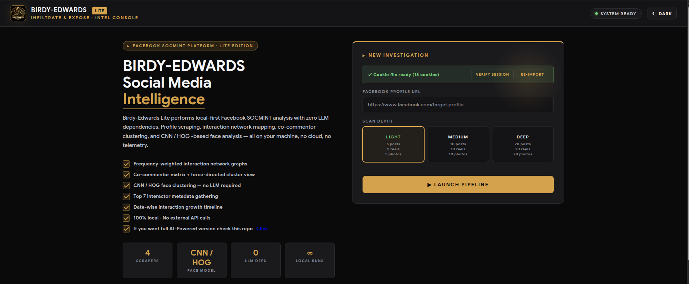
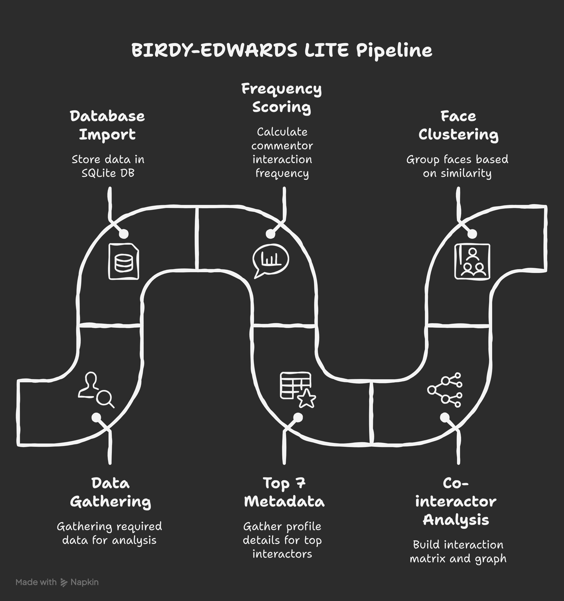

<div align="center">


# BIRDY-EDWARDS LITE

### *Infiltrate & Expose — No LLM Edition*

[](https://python.org)
[](https://flask.palletsprojects.com)
[](https://github.com/seleniumbase/SeleniumBase)
[]()
[]()
[]()

**Local-first Facebook SOCMINT platform — no LLM, no Docker, no cloud dependency.**

[Installation](#installation) · [Features](#features) · [Troubleshooting](#troubleshooting) · [Disclaimer](#️-disclaimer) · [Contributing](#contributing)

</div>

---

## What is Birdy-Edwards Lite?

Birdy-Edwards Lite is a stripped-down, dependency-light edition of the full Birdy-Edwards SOCMINT platform. It performs the same core profile intelligence workflow — data gathering, interaction mapping, face clustering, and network visualization — without requiring any AI model, Docker container, or cloud service.

Everything runs on your local machine. No GPU required. No model downloads. No external API calls.

It is designed for investigators who want fast, reproducible results on modest hardware, or who want to run the tool without the overhead of the full AI-powered version.





---

## Architecture

<div align="center">

</div>

---

## Features

- 🔍 **Profile data gathering** — Automated collection of posts, photos, reels, about data, comments, interactor names and profile links
- 📊 **Frequency scoring** — Weighted interaction frequency ranking across all post types (photo, reel, text)
- 🕸️ **Network graph** — Interactive force-directed graph showing target ↔ interactor relationships, frequency-weighted edges, fullscreen mode
- 🔗 **Co-interactor matrix** — Heatmap showing which interactors appeared together across posts, with threshold filtering (1+, 2+, 3+, 5+)
- 💠 **Co-interactor force graph** — Force-directed cluster view of interactor co-occurrence relationships, fullscreen mode
- 📈 **Interaction timeline** — Date-wise stacked bar chart of photo and text post interactions
- 🍩 **Distribution donut** — Breakdown of interactions by media type (photo / reel / text)
- 👤 **Face intelligence** — CNN / HOG face detection, 128D encoding, and identity clustering across all gathered images
- 🌳 **Face cluster tree** — Frequency-cascade hierarchy of detected persons, from most to least appearances
- 🎯 **Top 7 priority targets** — Highest-frequency interactors with about-data cards
- 📋 **About data cards** — Target and Top 7 interactor profile fields grouped by section (personal, work, education, etc.)
- 🗑️ **Investigation management** — Delete any investigation and all its gathered data (DB rows + face image files) from the home page
- 🌙 **Dark / light theme** — Full theme toggle across all dashboard components
- 🤖 **Zero LLM dependency** — No Ollama, no model download, no GPU needed

---

## Comparison — Lite vs Full

| Capability | Lite | Full (AI) |
|---|:---:|:---:|
| Profile data gathering | ✅ | ✅ |
| Interaction frequency scoring | ✅ | ✅ |
| Network + co-interactor graphs | ✅ | ✅ |
| Timeline + donut charts | ✅ | ✅ |
| CNN / HOG face clustering | ✅ | ✅ |
| Top 7 metadata gathering | ✅ | ✅ |
| AI sentiment / emotion analysis | ❌ | ✅ |
| Actor composite scoring | ❌ | ✅ |
| Country of origin detection | ❌ | ✅ |
| World map visualization | ❌ | ✅ |
| PDF intelligence report | ❌ | ✅ |
| Docker deployment | ❌ | ✅ |
| LLM required | ❌ None | ✅ Ollama |
| GPU required | ❌ | ✅ Recommended |

---

## System Requirements

| Component | Minimum | Recommended |
|---|---|---|
| OS | Ubuntu 22.04+ / Windows 10+ | Ubuntu 24.04 LTS |
| Python | 3.10+ | 3.12 |
| RAM | 4 GB | 8 GB |
| Storage | 5 GB free | 10 GB free |
| Browser | Chrome / Chromium | Latest Chrome |

---

## Installation

### Step 1 — Clone the repository

```bash
git clone https://github.com/jeet-ganguly/birdy-edwards-lite.git
cd birdy-edwards-lite
```

### Step 2 — Run the setup script

```bash
chmod +x setup.sh
./setup.sh
```

The setup script will:
- Check your Python version (3.10+ required)
- Install system build dependencies (cmake, build-essential, etc.)
- Create a Python virtual environment
- Compile and install dlib (5–10 minutes)
- Install face_recognition and models
- Install Flask, SeleniumBase, Pillow, NumPy
- Install Chrome driver
- Patch face_recognition_models for Python 3.12 compatibility
- Create required directories

> ⚠️ dlib compiles from source. This takes 5–10 minutes on first run. Do not interrupt it.

### Step 3 — Start the app

```bash
source venv/bin/activate
cd app
python3 app.py
```

### Step 4 — Open the web UI

```
http://localhost:5000
```

---

## Facebook Session Setup

Birdy-Edwards Lite uses the **Cookie-Editor** browser extension to import your Facebook session. No Selenium login prompt, no automated account interaction.

> 🔒 **Operational Security:** Use a dedicated investigation account rather than your personal Facebook account. This protects your identity and prevents your primary account from being flagged.

1. Install Cookie-Editor:
   - [Chrome](https://chromewebstore.google.com/detail/cookie-editor/hlkenndednhfkekhgcdicdfddnkalmd)
   - [Firefox](https://addons.mozilla.org/en-US/firefox/addon/cookie-editor/)
2. Log into your **dedicated investigation account** on Facebook
3. Click the Cookie-Editor icon while on `facebook.com`
4. Click **Export → Export as JSON**
5. Go to `http://localhost:5000`
6. Paste the copied JSON into the **IMPORT COOKIES** box
7. Click **SAVE COOKIES**

> Cookies expire periodically. Re-import fresh cookies if the pipeline fails at the data gathering stage.

---

## Running an Investigation

1. Go to `http://localhost:5000`
2. Verify the cookie status bar shows ✓ green
3. Enter the target Facebook profile URL
4. Select scan depth:
   - **Light** — 5 posts / 5 reels / 5 photos
   - **Medium** — 10 posts / 10 reels / 10 photos
   - **Deep** — 20 posts / 20 reels / 20 photos
5. Click **LAUNCH PIPELINE**
6. The pipeline overlay shows live progress across all 8 steps
7. On completion you are automatically redirected to the analysis dashboard

---

## Analysis Dashboard

The dashboard renders all gathered intelligence in one page without any server-side AI processing.

| Section | What it shows |
|---|---|
| **Interactor Registry** | All interactors ranked by total interaction count |
| **Apex Interactor** | The single most frequent interactor with full stats |
| **Interaction Distribution** | Donut chart — photo / reel / text split |
| **Timeline** | Date-wise stacked bar chart of interactions |
| **Top 7 Priority Targets** | Top 7 interactors with about-data VIEW button |
| **Network Graph** | Force-directed target ↔ interactor graph, fullscreen available |
| **Co-Interactor Matrix** | Heatmap of who appeared together, threshold filter |
| **Co-Interactor Force Graph** | Cluster view of co-occurrence, threshold filter, fullscreen |
| **Face Cluster Tree** | Frequency-cascade tree of detected persons |

Clicking any node or interactor row opens a side panel with interaction samples and profile link.

---

## ⚠️ Disclaimer

> BIRDY-EDWARDS LITE is developed strictly for **authorized intelligence, law enforcement, and academic research purposes only.**
>
> **Scope of data access:**
> - This tool operates exclusively using a valid Facebook session authenticated by the operator
> - It only accesses **publicly visible** profile data, posts, photos, reels, and comments
> - It does **not** access private messages, locked profiles, restricted content, or any data not visible to a logged-in user
> - It does **not** use bots, fake accounts, or automated account creation — the operator supplies their own authenticated session
>
> **Legal responsibility:**
> - This tool must only be used on profiles and content where you have **explicit legal authorization** to collect and analyze data
> - Use without authorization may violate Facebook's Terms of Service, applicable privacy laws (GDPR, IT Act, DPDP Act), and local regulations
> - The developer assumes **no liability** for misuse, unauthorized data collection, or any harm caused by improper use
> - All investigations are the **sole responsibility of the operator**
>
> By using BIRDY-EDWARDS LITE, you confirm that your use is lawful, authorized, and compliant with all applicable laws in your jurisdiction.

---

## Troubleshooting

**dlib compilation fails**
Make sure cmake and build-essential are installed. Run `sudo apt install cmake build-essential` then retry `pip install dlib`.

**face_recognition crashes or errors on Python 3.12**
The setup script patches `face_recognition_models` automatically. If you installed manually, run:
```bash
source venv/bin/activate
python3 -c "
import sys, os
path = os.path.join(sys.prefix, 'lib', f'python{sys.version_info.major}.{sys.version_info.minor}', 'site-packages')
print(path)
"
```
Then check that `face_recognition_models/__init__.py` does not reference `pkg_resources`.

**Pipeline fails at data gathering stage**
Your cookies have likely expired. Go to `http://localhost:5000`, re-export from Cookie-Editor, and re-import.

**No faces detected**
Facebook CDN URLs expire. Face clustering only works immediately after a fresh pipeline run while image URLs are still valid.

**Port 5000 already in use**
Edit `app.py` final line: change `port=5000` to `port=5001` then access at `http://localhost:5001`.

**DB error: no such table**
Delete the investigation from the home page and start a new one. The schema is created automatically on first use.

---

## Contributing

Contributions are welcome. Please follow these guidelines.

**Reporting bugs** — Open an Issue with steps to reproduce, OS, Python version, and relevant terminal output.

**Feature requests** — Open an Issue describing the feature and its investigative use case before opening a Pull Request.

**Submitting a Pull Request:**
```bash
git checkout -b feature/your-feature-name
git commit -m "Add: short description"
git push origin feature/your-feature-name
```
Then open a Pull Request against `main`.

**Code guidelines:**
- Python 3.12, Flask conventions
- Test locally before submitting
- Do not commit `fb_cookies.pkl`, databases, or any gathered data
- Keep gatherer changes minimal — Facebook DOM changes frequently

**What we welcome:** bug fixes, UI improvements, new chart types, dashboard features, documentation improvements, stability improvements.

**What we do not accept:** features that introduce cloud dependencies, changes that store or transmit gathered data externally, features that bypass platform security controls.

---

## Acknowledgements

- Inspired by [Sherlock](https://github.com/sherlock-project/sherlock) and the OSINT research community
- [SeleniumBase](https://github.com/seleniumbase/SeleniumBase) — Undetected Chrome automation
- [face_recognition](https://github.com/ageitgey/face_recognition) — Face detection and 128D encoding
- [D3.js](https://d3js.org) — Network and force-directed graph rendering
- [Chart.js](https://www.chartjs.org) — Timeline, donut, and bar chart rendering
- [Flask](https://flask.palletsprojects.com) — Web framework

---

<div align="center">

**BIRDY-EDWARDS LITE** · Infiltrate & Expose · No LLM · Local-First

</div>